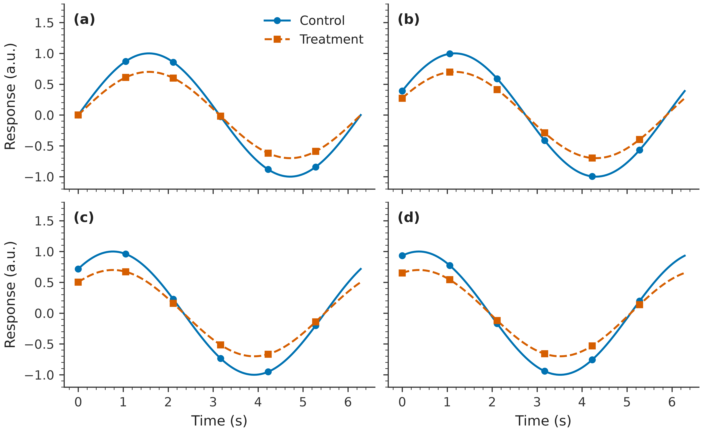

# rosen_style

Consistent, readable Matplotlib defaults for Rosen Research Group papers and presentations.

## Install

```bash
pip install git+https://github.com/Quantum-Accelerators/rosen_style.git
```

## Use

```python
import matplotlib.pyplot as plt
import rosen_style

rosen_style.use("paper")  # or "presentation"
fig, ax = plt.subplots()
ax.plot([0, 1, 2], [0, 1, 0])
ax.set(xlabel="Time (s)", ylabel="Response (a.u.)")
```

Use a context manager to apply a style temporarily:

```python
import matplotlib.pyplot as plt
import rosen_style

with rosen_style.context("paper"):
    fig, ax = plt.subplots()
    ax.scatter([1, 2, 3], [2.1, 3.8, 6.2])
    ax.set(xlabel="Concentration (mol/L)", ylabel="Response (a.u.)")
    fig.savefig("response.png")  # saved at the style default of 600 DPI
```

Paper figures default to a 3.25-inch width, with height chosen using the golden ratio. Use `wide=True` for a 7-inch-wide figure:

```python
with rosen_style.context("paper", wide=True):
    fig, ax = plt.subplots()
    ax.plot([0, 1, 2], [0, 1, 0])
    fig.savefig("wide.png")
```

Pass `square=True` for equal figure width and height, which is useful for parity plots and heatmaps. See the [main Matplotlib settings](src/rosen_style/_style.py) for the complete defaults.

Outside the `with` block, Matplotlib's previous settings are restored.

The defaults use 600 DPI for display and saved output, a color-vision-friendly categorical cycle, the perceptually uniform `plasma` image colormap, readable labels, white saved backgrounds, no grid lines, and minor ticks in paper mode. Figure titles are intentionally left to captions or surrounding presentation content. Pair color with markers, line styles, or direct labels when it carries meaning.

## Examples

Line plot:


Scatter plot (with `square=True`):


Heatmap with a perceptually uniform color scale:


### Multiple subpanels

The style works with Matplotlib's standard subplot layouts. Use `nrows` and
`ncols` to arrange panels; `wide=True` sets the total paper figure width to
7 inches. Font and line sizes stay
at paper defaults.

```python
with rosen_style.context("paper", wide=True):
    fig, axes = plt.subplots(2, 2, sharex=True, sharey=True)
    for ax in axes.flat:
        ax.plot([0, 1, 2], [0, 1, 0])
        ax.set(xlabel="Time (s)", ylabel="Response (a.u.)")
        ax.label_outer()
    fig.savefig("subpanels.pdf")
```



## Design references

- [Claus O. Wilke, *Fundamentals of Data Visualization*](https://clauswilke.com/dataviz/)

There are also many excellent Python examples on [The Python Graph Gallery](https://www.python-graph-gallery.com/) and [Python Charts](https://python-charts.com/) websites. For what not to do, check out the "[Friends Don't Let Friends Make Bad Graphs](https://github.com/cxli233/FriendsDontLetFriends)" repository.
