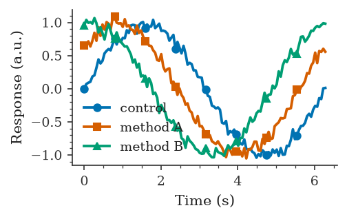
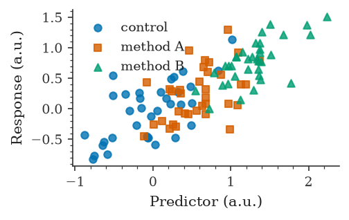
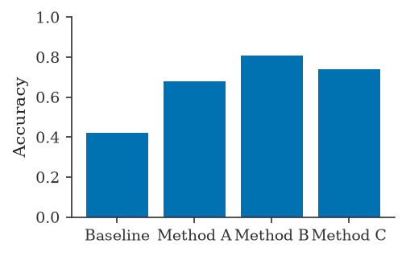
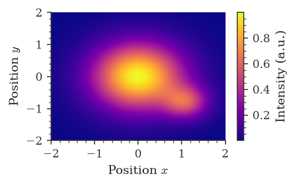

# rosen_style

Consistent, readable Matplotlib defaults for Rosen research-group papers and presentations.

## Install

```bash
pip install git+https://github.com/Quantum-Accelerators/rosen_style.git
```

## Use

```python
import matplotlib.pyplot as plt
import rosen_style

rosen_style.use("paper")  # or "presentation"
fig, ax = plt.subplots()
ax.plot([0, 1, 2], [0, 1, 0])
ax.set(xlabel="Time (s)", ylabel="Response (a.u.)")
```

Use a context manager to apply a style temporarily:

```python
import matplotlib.pyplot as plt
import rosen_style

with rosen_style.context("paper"):
    fig, ax = plt.subplots()
    ax.scatter([1, 2, 3], [2.1, 3.8, 6.2])
    ax.set(xlabel="Concentration (mol/L)", ylabel="Response (a.u.)")
    fig.savefig("response.png")  # saved at the style default of 600 DPI
```

Paper figures default to a 3.25-inch single-column width, with height chosen using the golden ratio. Use `columns=2` for a 7-inch double-column figure:

```python
with rosen_style.context("paper", columns=2):
    fig, ax = plt.subplots()
    ax.plot([0, 1, 2], [0, 1, 0])
    fig.savefig("double-column.png")
```

Outside the `with` block, Matplotlib's previous settings are restored. Mathematical notation such as `r"Position $x$"` is rendered by Matplotlib's built-in MathText engine and requires no external typesetting installation.

The defaults use 600 DPI for display and saved output, a color-vision-friendly categorical cycle, the perceptually uniform `plasma` image colormap, readable labels, transparent saved backgrounds, no grid lines, and minor ticks in paper mode. Figure titles are intentionally left to captions or surrounding presentation content. Pair color with markers, line styles, or direct labels when it carries meaning.

## Examples

Line plot:



Scatter plot:



Bar plot:



Heatmap with a perceptually uniform color scale:



CI regenerates and commits these images when their source or the styles change.

## Structure visualization

For publication-ready atomic structures, we recommend [Pretty Lattice](https://github.com/songfeitong/pretty-lattice) for periodic materials and [xyzrender](https://github.com/aligfellow/xyzrender) for molecules.

## Development

```bash
pip install -e .[dev]
pytest
python examples/build_readme_figures.py
ruff check .
```

The test suite renders both styles without external system dependencies.

## Design references

- [Claus O. Wilke, *Fundamentals of Data Visualization*](https://clauswilke.com/dataviz/)

There are also many excellent Python examples on [The Python Graph Gallery](https://www.python-graph-gallery.com/) and [Python Charts](https://python-charts.com/) websites. For what not to do, check out the "[Friends Don't Let Friends Make Bad Graphs](https://github.com/cxli233/FriendsDontLetFriends)" repository.
