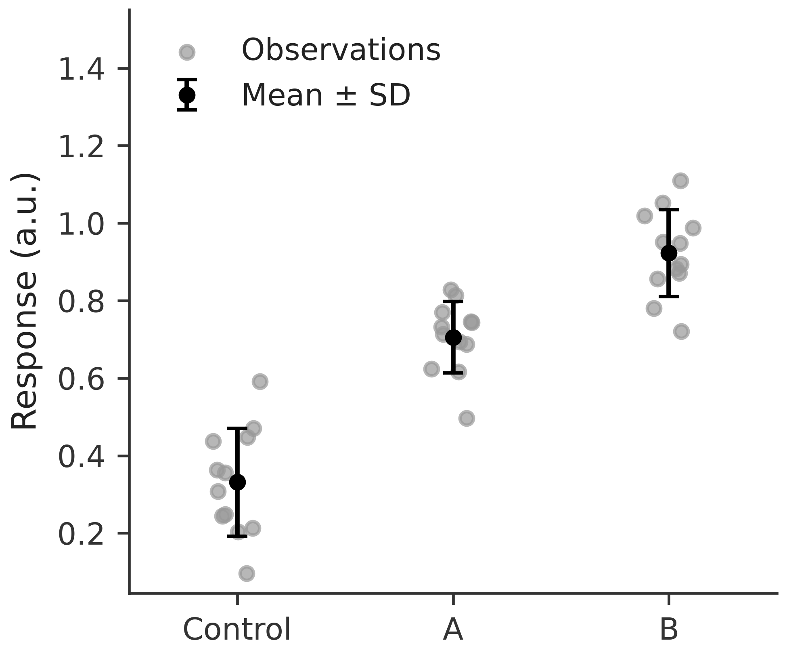
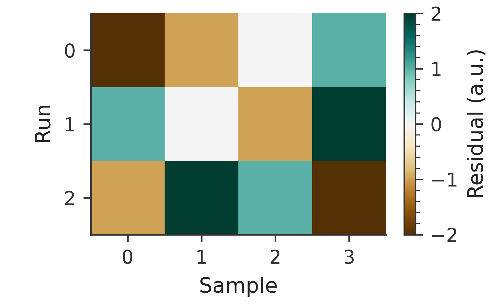

# rosen_style

Consistent, readable Matplotlib defaults for Rosen Research Group papers and presentations.

## Install

```bash
pip install git+https://github.com/Quantum-Accelerators/rosen_style.git
```

## Use

```python
import matplotlib.pyplot as plt
import rosen_style

rosen_style.use("paper")  # or "presentation"
fig, ax = plt.subplots()
ax.plot([0, 1, 2], [0, 1, 0])
ax.set(xlabel="Time (s)", ylabel="Response (a.u.)")
```

Use a context manager to apply a style temporarily:

```python
import matplotlib.pyplot as plt
import rosen_style

with rosen_style.context("paper"):
    fig, ax = plt.subplots()
    ax.scatter([1, 2, 3], [2.1, 3.8, 6.2])
    ax.set(xlabel="Concentration (mol/L)", ylabel="Response (a.u.)")
    fig.savefig("response.png")  # saved at the style default of 600 DPI
```

Paper figures default to a 3.25-inch single-column width, with height chosen using the golden ratio. Use `columns=2` for a 7-inch double-column figure:

```python
with rosen_style.context("paper", columns=2):
    fig, ax = plt.subplots()
    ax.plot([0, 1, 2], [0, 1, 0])
    fig.savefig("double-column.png")
```

Outside the `with` block, Matplotlib's previous settings are restored. Mathematical notation such as `r"Position $x$"` is rendered by Matplotlib's built-in MathText engine and requires no external typesetting installation.

The defaults use 600 DPI for display and saved output, a color-vision-friendly categorical cycle, the perceptually uniform `plasma` image colormap, readable labels, white saved backgrounds, no grid lines, and minor ticks in paper mode. Figure titles are intentionally left to captions or surrounding presentation content. Pair color with markers, line styles, or direct labels when it carries meaning.

Prefer `fig.savefig("response.pdf")` for publication: PDF/PS exports embed TrueType fonts, and SVG exports retain editable text (the viewing system needs the font installed). Saved backgrounds now default to white to preserve contrast; use `transparent=True` in `savefig` when transparency is intended.

See the [scientific figure guide](docs/figure-guide.md) for source-backed design choices, final-size checks, journal overrides, uncertainty, diverging color scales, and export advice. The presets are group defaults, not journal-specific submission specifications.

## Examples

Line plot:


Scatter plot:


Bar plot:


Heatmap with a perceptually uniform color scale:


Observations with mean ± one sample SD (synthetic data, 12 observations per group; these intervals show spread, not confidence intervals):



Signed residuals with a diverging scale centered at zero:



CI builds these images for pull requests and commits regenerated images after changes reach `main`.

## Design references

- [Claus O. Wilke, *Fundamentals of Data Visualization*](https://clauswilke.com/dataviz/)
- [Nature research figure specifications](https://research-figure-guide.nature.com/figures/preparing-figures-our-specifications/)
- [Rougier, Droettboom & Bourne, *Ten Simple Rules for Better Figures*](https://doi.org/10.1371/journal.pcbi.1003833)

There are also many excellent Python examples on [The Python Graph Gallery](https://www.python-graph-gallery.com/) and [Python Charts](https://python-charts.com/) websites. For what not to do, check out the "[Friends Don't Let Friends Make Bad Graphs](https://github.com/cxli233/FriendsDontLetFriends)" repository.
