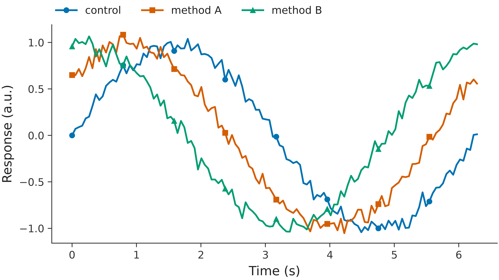
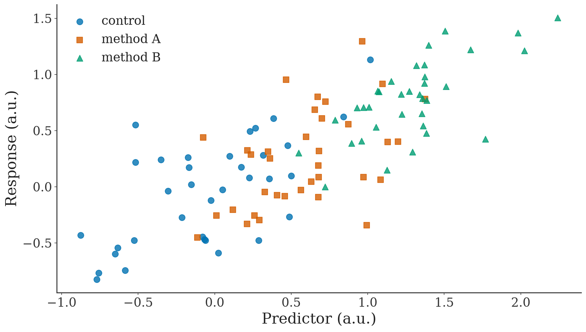
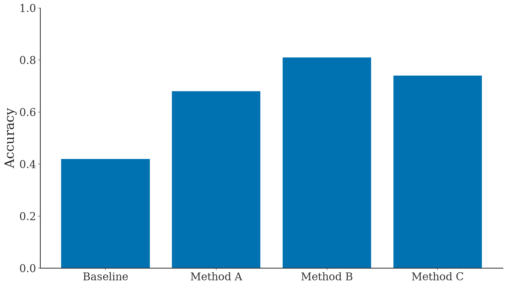
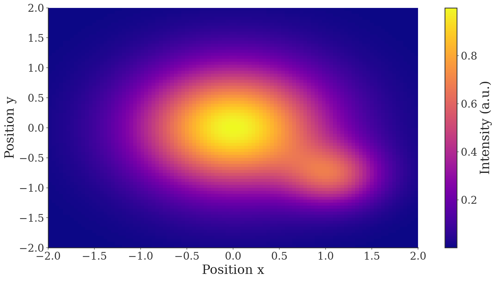

# rosen_style

Consistent, readable Matplotlib defaults for Rosen research-group papers and presentations.

## Install

```bash
pip install git+https://github.com/Quantum-Accelerators/rosen_style.git
```

## Use

```python
import matplotlib.pyplot as plt
import rosen_style

rosen_style.use("paper")  # or "presentation"
fig, ax = plt.subplots()
ax.plot([0, 1, 2], [0, 1, 0])
ax.set(xlabel="Time (s)", ylabel="Response (a.u.)")
```

Use `with rosen_style.context("paper"):` for temporary styling. LaTeX is selected automatically when a `latex` executable is available; pass `latex=False` to use Matplotlib's built-in renderer.

The defaults use a color-vision-friendly categorical cycle, the perceptually uniform `plasma` image colormap, readable labels, no grid lines, and minor ticks in paper mode. Figure titles are intentionally left to captions or surrounding presentation content. Pair color with markers, line styles, or direct labels when it carries meaning.

## Examples

### Paper

Line plot:


Scatter plot:


Bar plot:


Heatmap with a perceptually uniform color scale:


### Presentation

Line plot:



Scatter plot:



Bar plot:



Heatmap with a perceptually uniform color scale:



CI regenerates and commits these images when their source or the styles change.

## Development

```bash
pip install -e .[dev]
pytest
python examples/build_readme_figures.py
ruff check .
```

Tests disable LaTeX rendering, so CI does not require a TeX installation.

## Design references

- [Claus O. Wilke, *Fundamentals of Data Visualization*](https://clauswilke.com/dataviz/)
- [Crameri, Shephard & Heron, “The misuse of colour in science communication”](https://www.nature.com/articles/s41467-020-19160-7)
