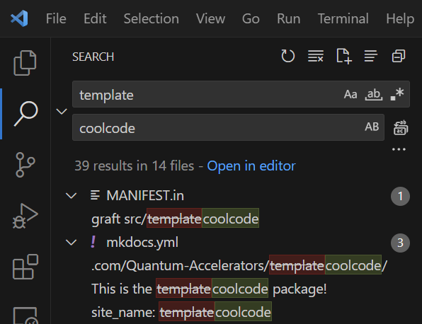

# Updating the Name

Now for your first major task: **replace all instances of the word "rosen_style" with your desired package name**.

!!! Note

    Don't forget to update the name of the `/src/rosen_style` folder, e.g. so that it is of the form `src/<MyPackageName>`.

!!! Tip

    If you're using [Visual Studio Code](https://code.visualstudio.com/) as your editor, you can do `ctrl+shift+H` to find-and-replace all instances of "rosen_style" with your own package name.

    
